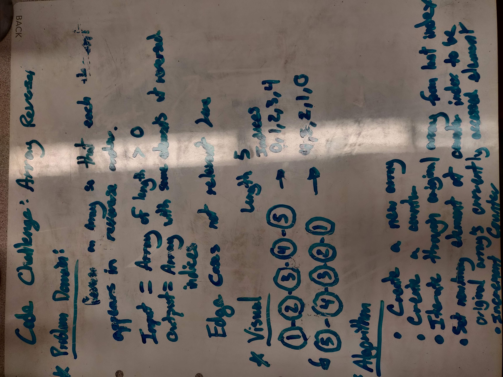
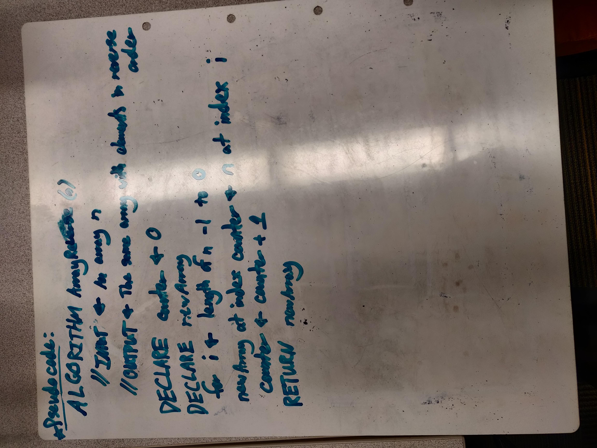
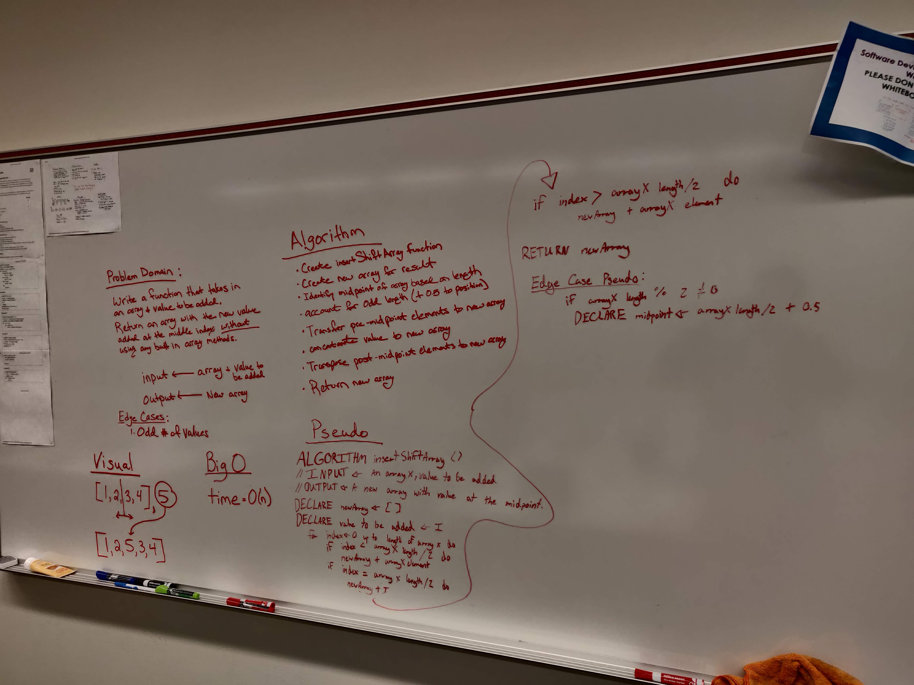
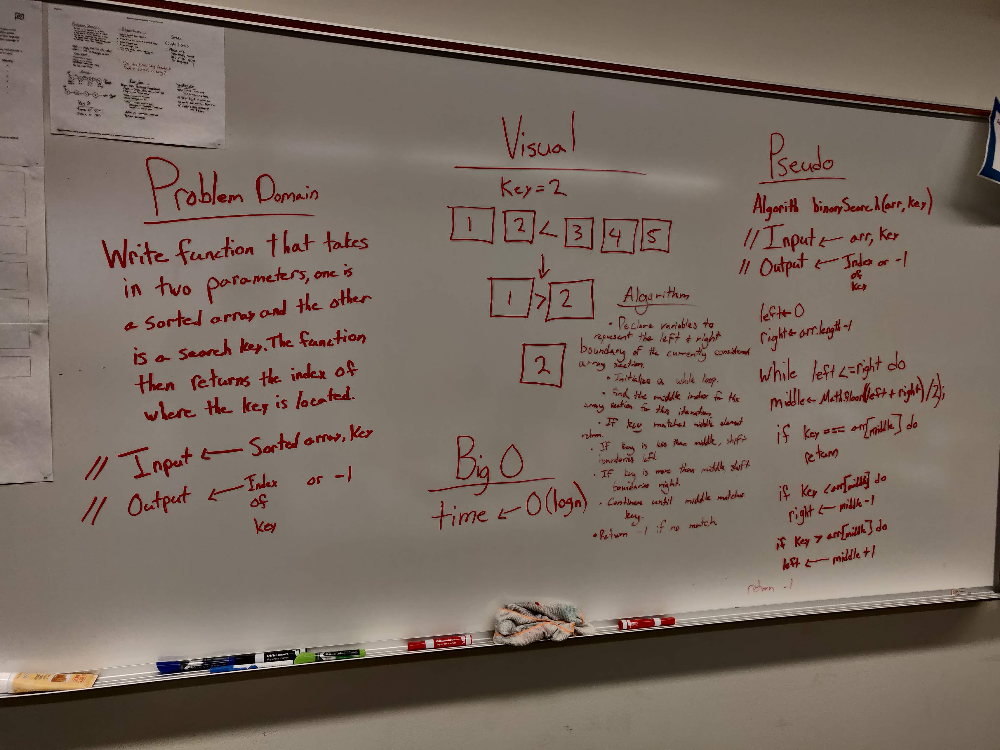
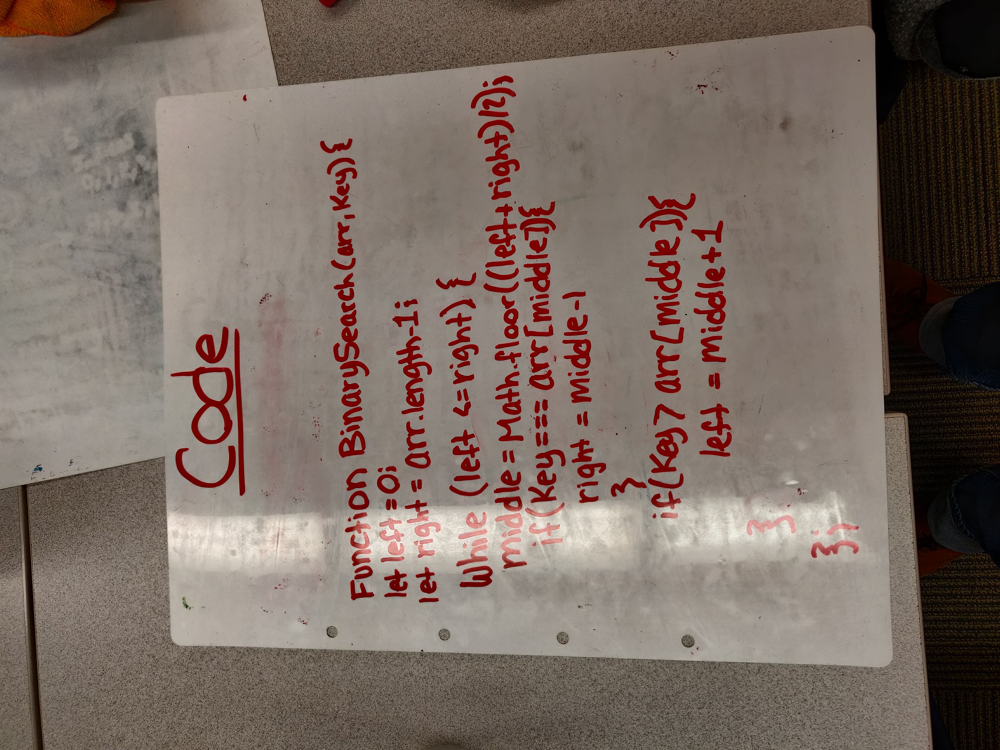

# README
<!-- TODO: Split readme into modules -->
[Travis - CI](https://travis-ci.com/pseudotsuga-401-advanced-javascript/data-structures-and-algorithms)

# Table of Contents

## [Array Reversal](#Reverse-Array)
## [Array Shift](#Shift-Array)
## [Array Binary Search](#Binary-Search-Array)
## [Linked List](#Linked-List)
## [Stacks and Queues](#Stacks-and-Queues)

# Reverse Array

## Teammate

- Lindsey Peltier

For our first coding challenge of code 401 we have been tasked to accept an inputted array of numbers and then return an a new array of the same numbers with in reverse order. We have also been asked to do this without access to any of the built-in Array Methods of ES6. 

## [Code](./challenges/ArrayReverse/array-reverse.js)

## Challenge

Reverse an Array.

## Approach and Efficiency 

We took the approach of declaring a counter to represent the number of array elements we visited while also decrementing a for loop so that the last element of the source array would be transposed to the first index position of the new array and so on for the length of the array. I believe time complexity should be O(n) or linear time. This is a guess after some quick reading and I am still uncertain as to how to calculate space complexity.  

## Solution





# Shift Array

- Lindsey Peltier

This challenge also involved array manipulation. In contrast to the previous challenge it requires insertion and removal of an array element as opposed to rearrangement. 

## [Code](./challenges/ArrayShift/array-shift.js)

## Challenge

Write a function called insertShiftArray which takes in an array and the value to be added. Without utilizing any of the built-in methods available to your language, return an array with the new value added at the middle index.

## Approach and Efficiency 

The first key to the solution we generated was finding the midpoint of the array as it was our target for element removal and addition. This was fairly simple. First we divided the length of the array in half to get a middle value. Second we had to handle non-integer values that would be generated by arrays of odd length so we rounded our midpoint value upwards. There isn't much of a functional difference in terms of the direction-of-round but our selection was made to carefully match the input/output examples.

After that the program loops through the array provided in the function parameters appending each element until it reaches the midpoint. Once it has done so it appends both the value to be added (also provided as a parameter) and then the element originally in that position immediately after the new value. It then resumes the simple append for the remainder of the provided array, transposing those values to the new array before it is eventually returned. 

## Solution



# Binary Search Array

## Teammates

- Natalie Alway
- Trevor Thomphson

Sorting algorithms are very satisfying to code. Binary search is a method of searching that looks at the middle of a sorted array, discards the half where a target value cannot lie, and repeats this process until the final position of the target array value can be returned. 

## [Code](./challenges/ArrayBinarySearch/array-binary-search.js)
## [Tests](./__tests__/array-binary-search.test.js)

## Challenge

Write a function called binarySearch which takes in 2 parameters: a sorted array and the search key. Without utilizing any of the built-in methods available to your language, return the index of the array’s element that is equal to the search key, or -1 if the element does not exist.

## Approach and Efficiency 

We first divide the length of the array by two and round down to find the middle index. Whatever value lies here is compared to our target and then one of three cases occurs:
1. The middle value equals the target and its index is returned.
2. The middle value is less than the target so the left boundary is reassigned to the index value of the middle element. 
3. The middle value is greater than the target and the right boundary is reassigned to the index value of the middle element.

All of this occurs inside of a while loop as insurance in case the target value is not within the sorted array. If this proves to be true the while loop will end, and the value -1 will be returned.

## Solution




# Linked List

<!-- TODO: Update -->
For our first coding challenge of code 401 we have been tasked to accept an inputted array of numbers and then return an a new array of the same numbers with in reverse order. We have also been asked to do this without access to any of the built-in Array Methods of ES6. 

## [Code](./challenges/linkedList/linked-list.js)

## Challenge

Implement a linked list data structure in JavaScript. 

## Approach and Efficiency 
<!-- TODO: Update for linked lists-->
We took the approach of declaring a counter to represent the number of array elements we visited while also decrementing a for loop so that the last element of the source array would be transposed to the first index position of the new array and so on for the length of the array. I believe time complexity should be O(n) or linear time. This is a guess after some quick reading and I am still uncertain as to how to calculate space complexity.  

## Solution
<!-- TODO: Add UML Images Here -->
<!--  -->
<!--  -->

# Stacks and Queues
Stacks and Queues are each data structures with unique properties and thus are suited to unique challenges. You can find my complete write-up [here](https://github.com/pseudotsuga-401-advanced-javascript/bend-javascript-401d3/wiki/Discussion-Write-Ups:-Stacks-and-Queues).

## Challenge
Implement both a stack and queue data structure in JavaScript. 

## Approach & Efficiency
I don't believe this provided category is relevant to this particular challenge. I welcome comments to the contrary if they can be reasonably supported. 

## API
### Stack Methods:
- ```peek()```:
  - This method takes no parameters and returns the node at the top position of the stack if one exists. It does not mutate the stack. 
- ```pop()```:
  - This method takes no parameters. It removes the top node from the stack and then returns it. That order of operations is critical for garbage collection.
- ```push(<value>)```: 
  - This method takes a value as a parameter, instantiates a node with that value, and then places that node onto the top position of the stack. It returns undefined. 
- ```isEmpty()```:
  - This method takes no parameters and returns a boolean value representing whether or not the stack contains any nodes. 

### Queue Methods
- ```enqueue(<value>)```:
  - This method takes a value as a parameter, instantiates a node with that value, and then places that node at the rear of the queue. In the case of an empty queue the front property will also be pointed to the newly instantiated node. 
- ```dequeue()```:
  - This method takes no parameters. It removes the node at the front position of the queue and returns it. 
- ```peek()```:
  - This method takes no parameters. It returns the node at the front position of the queue without removing it from the queue. 
- ```isEmpty()```:
  - This method takes no parameters and returns a boolean representing if the queue contains any nodes. 