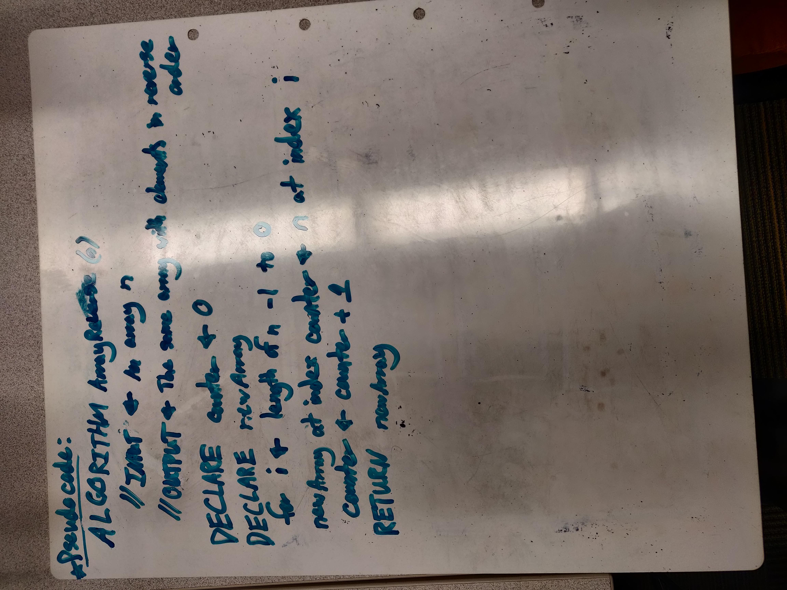

# Table of Contents

## [Array Reversal](#Reverse-Array)
## [Array Shift](#Shift-Array)
## [Array Binary Search](#Binary-Search-Array)

# Reverse Array

For our first coding challenge of code 401 we have been tasked to accept an inputted array of numbers and then return an a new array of the same numbers with in reverse order. We have also been asked to do this without access to any of the built-in Array Methods of ES6. 

## [Code](./challenges/ArrayReverse/array-reverse.js)

## Challenge

Reverse an Array.

## Approach and Efficiency 

We took the approach of declaring a counter to represent the number of array elements we visited while also decrementing a for loop so that the last element of the source array would be transposed to the first index position of the new array and so on for the length of the array. I believe time complexity should be O(n) or linear time. This is a guess after some quick reading and I am still uncertain as to how to calculate space complexity.  

## Solution

# Shift Array

This challenge also involved array manipulation. In contrast to the previous challenge it requires insertion and removal of an array element as opposed to rearrangement. 

## [Code](./challenges/ArrayShift/array-shift.js)

## Challenge

Write a function called insertShiftArray which takes in an array and the value to be added. Without utilizing any of the built-in methods available to your language, return an array with the new value added at the middle index.

## Approach and Efficiency 

The first key to the solution we generated was finding the midpoint of the array as it was our target for element removal and addition. This was fairly simple. First we divided the length of the array in half to get a middle value. Second we had to handle non-integer values that would be generated by arrays of odd length so we rounded our midpoint value upwards. There isn't much of a functional difference in terms of the direction-of-round but our selection was made to carefully match the input/output examples.

After that the program loops through the array provided in the function parameters appending each element until it reaches the midpoint. Once it has done so it appends both the value to be added (also provided as a parameter) and then the element originally in that position immediately after the new value. It then resumes the simple append for the remainder of the provided array, transposing those values to the new array before it is eventually returned. 

## Solution

# Binary Search Array

(CHALLENGE SUMMARY AND NOTES HERE)

## [Code](./challenges/ArrayBinarySearch/array-binary-search.js)
## [Tests](./challenges/ArrayBinarySearch/array-binary-search.test.js)

## Challenge

Write a function called binarySearch which takes in 2 parameters: a sorted array and the search key. Without utilizing any of the built-in methods available to your language, return the index of the array’s element that is equal to the search key, or -1 if the element does not exist.

## Approach and Efficiency 

## Solution

